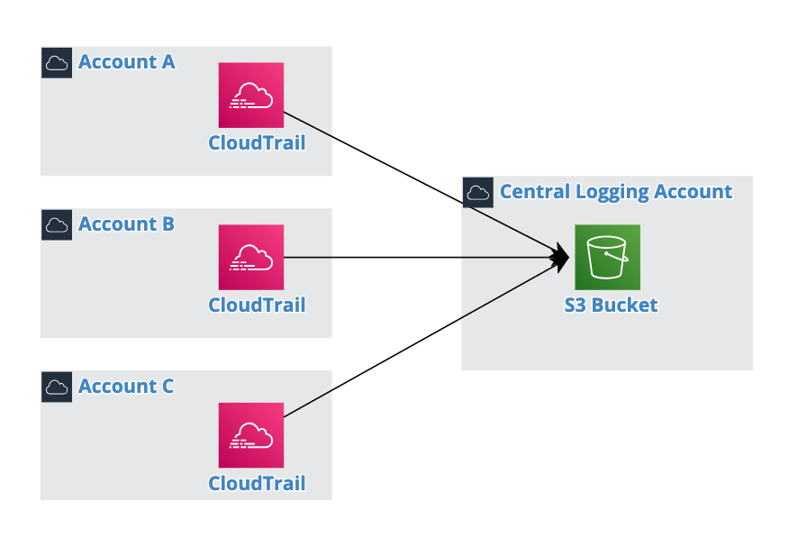

# CloudTrail

AWS CloudTrail은 AWS 인프라에서 행해지는 모든 작업을 기록, 모니터링 및 보관할 수 있으며 이를 기반으로 규정 준수, 보안 분석, 비정상적인 활동 탐지 등을 자동화 또는 간소화 하는데 도움을 줍니다. 다수의 사용자가 다수의 AWS 인프라에서 동시에 개발 및 운영할때 CloudTrail를 이용해서 이력관리가 가능해 집니다.

- Activity Monitoring: AWS Management Console, CLI, API, SDK 등을 통해서 이루어진 작업 내용을 기록

- 로그 저장: S3에 로그를 저장할수 있고 Athena를 통해서 S3에 저장된 로그에 쿼리를 실행

- 다른 AWS서비스들 연계: 알람 생성, 접근 / 사용 패턴 분석 및 Event-driven 작업 생성

## CloudTrail 생성

1. AWS Management Console에서 좌측 상단에 있는 **[Services]** 를 선택하고 검색창에서 CloudTrail를 검색하거나 **[Management & Governance]** 밑에 있는 **[CloudTrail]** 를 선택

2. **[Create trail]** &rightarrow; **Trail name** = <YOUR_INITIAL>-cloudtrail, **S3 Bucket** = <YOUR_INITIAL>-cloudtrail-logs &rightarrow; **[Create]**

## Query Events

EC2, RDS, S3, DynamoDB, IAM, 기타등등의 Dashboard에 들어가 보는등 AWS Management console을 브라우징 하거나 CLI, API 또는 AWS SDK를 통해서 리소스 생성 또는 수정작업을 실행해서 Trail 로그 생성

### S3 Select

1. AWS Management Console에서 좌측 상단에 있는 **[Services]** 를 선택하고 검색창에서 S3를 검색하거나 **[Storage]** 바로 밑에 있는 **[S3]** 를 선택

2. 위에서 생성된 S3 Bucket을 선택 &rightarrow; **AWSLogs** &rightarrow; <AWS_ACCOUNT_ID> &rightarrow; **CloudTrail** &rightarrow; <AWS_REGION> &rightarrow; YYYY &rightarrow; MM &rightarrow; DD &rightarrow; 로그파일 선택 &rightarrow; 우측 상단 탭에서 **[Select from]** 선택 &rightarrow; **[Show file preview]**

    ```json
    {
        "Records": [
            {
                "eventVersion": "1.05",
                "userIdentity": {
                    "type": "IAMUser",
                    "principalId": "ABCDEFGHIJKLMNOPQRSTUVWXYZ",
                    "arn": "arn:aws:iam::1234567890:user/woo",
                    "accountId": "1234567890",
                    "accessKeyId": "ABCDEFGHIJKLMNOPQRSTUVWXYZ",
                    "userName": "woo",
                    "sessionContext": {
                        "sessionIssuer": {},
                        "webIdFederationData": {},
                        "attributes": {
                            "mfaAuthenticated": "true",
                            "creationDate": "2019-12-30T01:33:17Z"
                        }
                    },
                    "invokedBy": "signin.amazonaws.com"
                },
                "eventTime": "2019-12-30T05:25:30Z",
                "eventSource": "ec2.amazonaws.com",
                "eventName": "DescribeInstances",
                "awsRegion": "ap-northeast-2",
                "sourceIPAddress": "123.123.123.123",
                "userAgent": "signin.amazonaws.com",
                "requestParameters": {
                    "maxResults": 1000,
                    "instancesSet": {},
                    "filterSet": {}
                },
                "responseElements": null,
                "requestID": "d8199693-a9c0-4885-86a4-402b455625ee",
                "eventID": "90ba7b1c-9405-4afb-96c2-ff0356fce66e",
                "eventType": "AwsApiCall",
                "recipientAccountId": "1234567890"
            }
        ]
    }
    ```

3. **[NEXT]** &rightarrow; **SQL editor** 에서 아래의 Query 구문을 실행해서 특정 IP 주소에서 온 API Call의 리스트를 필터

    ```sql
    select * from s3object[*].Records[*] as records where records.sourceIPAddress != '<YOUR_IP_ADDRESS>';
    ```

### AWS Console

CloudTrail Dashboard 에서 **[Event history]** 로 이동후 이벤트 필터

- Root User 로그: User name = root

- 전체 S3 Bucket 로그: Resource type = Bucket

- 특정 S3 Bucket 로그: Resource name = <YOUR_INITIAL>-cloudtrail-logs

- 특정 시간대 로그: Time range에서 From을 어제로, To를 오늘로 설정후  **[Apply]**

### AWS CLI

AWS CLI를 [설치](https://docs.aws.amazon.com/cli/latest/userguide/install-cliv1.html)하고 [설정](https://docs.aws.amazon.com/cli/latest/userguide/cli-chap-configure.html)후 아래의 커맨드 실행

- 지난 90일간의 이벤트 로그

    ```bash
    aws cloudtrail lookup-events
    ```

- 지난 90일간의 이벤트 로그 중에서 100개만 불러오기

    ```bash
    aws cloudtrail lookup-events --max-items 100
    ```

- 2019년 12월 1일에 발생한 이벤트 로그 불러오기 (UTC기준)

    ```bash
    aws cloudtrail lookup-events --start-time 2019-12-01 --end-time 2019-12-02
    ```

- 특정 IAM User 로그:

    ```bash
    aws cloudtrail lookup-events --lookup-attributes AttributeKey=Username,AttributeValue=<USERNAME>
    ```

- EC2 인스턴스 삭제 이벤트 로그:

    ```bash
    aws cloudtrail lookup-events --lookup-attributes AttributeKey=EventName,AttributeValue=TerminateInstances
    ```

### AWS Athena

1. CloudTrail Dashboard 에서 **[Event history]** 로 이동후 **Run advanced queries in Amazon Athena** &rightarrow; **Storage location** = Trail이 저장된 S3 Bucket 지정 &rightarrow; **[Create table]** &rightarrow; Athena table name을 메모하고  **[Go to Athena]**  

2. Athena Dashboard에서 위에서 생성된 Table 오른쪽 끝에 **⋮**를 클릭 하고 **[Preview table]** 를 통해서 데이터 미리보기

3. Query

    - 특정 IAM User 로그:

        ```sql
        SELECT * FROM "default"."<TABLE_NAME>" WHERE useridentity.username = '<USERNAME>';
        ```

    - 다수의 IAM User 로그:

        ```sql
        SELECT * FROM "default"."<TABLE_NAME>" WHERE useridentity.username = '<USERNAME_1>' OR useridentity.username = '<USERNAME_2>';
        ```

    - 최근 7일이내에 접속한 유저:

        ```sql
        SELECT DISTINCT useridentity.username FROM "default"."<TABLE_NAME>" WHERE from_iso8601_timestamp(eventtime) > date_add('day', -7, now());
        ```

    - Root User 로그:

        ```sql
        SELECT * FROM "default"."<TABLE_NAME>" WHERE useridentity.type = 'Root';
        ```

## Cross Account Trail



1. S3 Dashboard로 이동후 Trail이 저장되는 Bucket 클릭

2. **[Permissions]** &rightarrow; **[Bucket Policy]** &rightarrow; 아래 Policy 블록을 Bucket policy editor에 붙여놓고 **<BUCKET_NAME>** 에 해당 S3 Bucket 이름, **<ACCOUNT_B_ID>** 에  **[Save]**\

    ```json
    {
      "Version": "2012-10-17",
      "Statement": [
        {
          "Sid": "AWSCloudTrailAclCheck",
          "Effect": "Allow",
          "Principal": {
            "Service": "cloudtrail.amazonaws.com"
          },
            "Action": "s3:GetBucketAcl",
            "Resource": "arn:aws:s3:::<BUCKET_NAME>"
          },
          {
            "Sid": "AWSCloudTrailWrite",
            "Effect": "Allow",
            "Principal": {
              "Service": "cloudtrail.amazonaws.com"
            },
            "Action": "s3:PutObject",
            "Resource": [
              "arn:aws:s3:::<BUCKET_NAME>/AWSLogs/<ACCOUNT_A_ID>/*",
              "arn:aws:s3:::<BUCKET_NAME>/AWSLogs/<ACCOUNT_B_ID>/*"
            ],
            "Condition": { 
              "StringEquals": { 
              "s3:x-amz-acl": "bucket-owner-full-control" 
              }
            }
          }
      ]
    }
    ```

3. 다른 AWS 계정으로 접속후 CloudTrail Dashboard로 이동

4. **[Create trail]** &rightarrow; **Trail name** = <YOUR_INITIAL>-cloudtrail, **Create a new S3 bucekt** = No, **S3 Bucket** = 다른 계정에 생성한 Trail Bucket &rightarrow; **[Create]**

## [Root 유저 로그인 알람 설정](https://github.com/fitcloud/aws-root-account-best-practice#root-%EC%9C%A0%EC%A0%80-%EB%A1%9C%EA%B7%B8%EC%9D%B8-slack-%EC%95%8C%EB%9E%8C-%EC%84%A4%EC%A0%95)